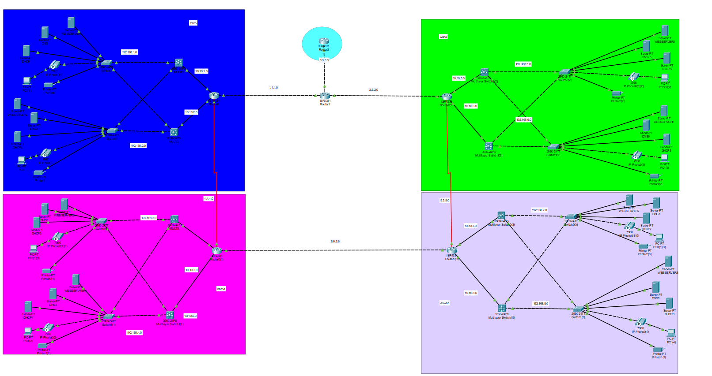
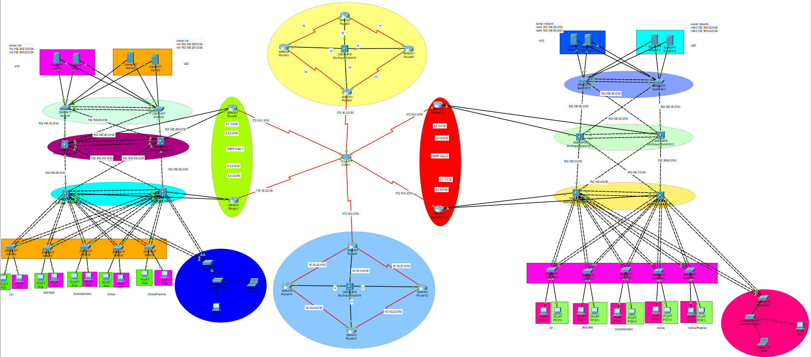
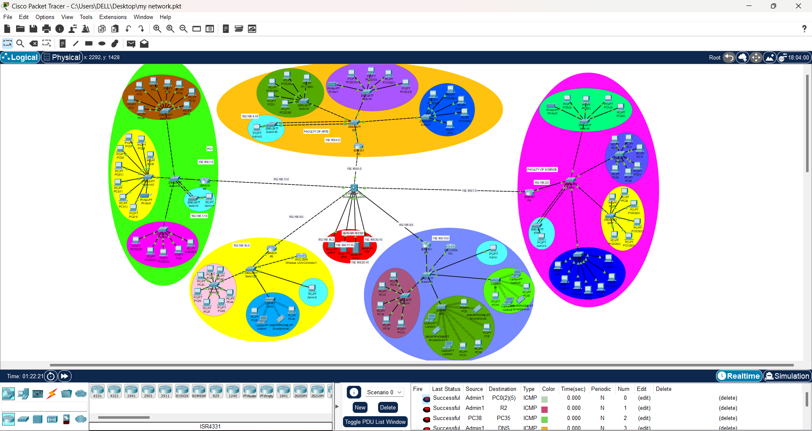

# Simulation of 3 Networks (Bank, Company, University)

## Overview
This project involves the design and configuration of a **secure and scalable network** using **Cisco Packet Tracer**. It showcases advanced networking techniques to interconnect three separate networks representing a **Bank**, a **Company**, and a **University**.

---

## Features
- **Network Design:** A total of 100+ devices distributed across three networks.
- **Advanced Configurations:**
  - VLANs for traffic segmentation.
  - Access Control Lists (ACLs) for enhanced security.
  - Quality of Service (QoS) for optimized traffic management.
- **Dynamic Routing:**
  - Reduced downtime by 40% using **OSPF** and **EIGRP** configurations.

---

## Tools Used
- **Cisco Packet Tracer:** For network design and simulation.
- **Networking Techniques:**
  - Virtual LAN (VLAN) setup.
  - Dynamic routing protocols: OSPF and EIGRP.
  - Security with ACLs.
  - Traffic prioritization using QoS.

---

## Network Design and Screenshots

### Full Network Diagram
- **Description:** A high-level overview of the interconnected networks for the Bank, Company, and University.

---

### Bank Network
- **Description:** The secure and segmented network designed for the bank. Includes routers, switches, and end devices.
- **Screenshot:**
  

---

### Company Network
- **Description:** Scalable and efficient network designed for the company with VLANs for department segmentation.
- **Screenshot:**
  

---

### University Network
- **Description:** Comprehensive network supporting students, staff, and research needs with optimized QoS for high-bandwidth applications.
- **Screenshot:**
  

---

## Configurations

### Routing Protocols
- **OSPF (Open Shortest Path First):**
  - Facilitates dynamic routing across the interconnected networks.
  - Optimized link utilization for reduced downtime.

- **EIGRP (Enhanced Interior Gateway Routing Protocol):**
  - Provides fast convergence and supports large-scale deployments.

---

## Installation and Usage

### Requirements
- Cisco Packet Tracer (Version 7.3 or later).
- Basic understanding of networking concepts.

 
